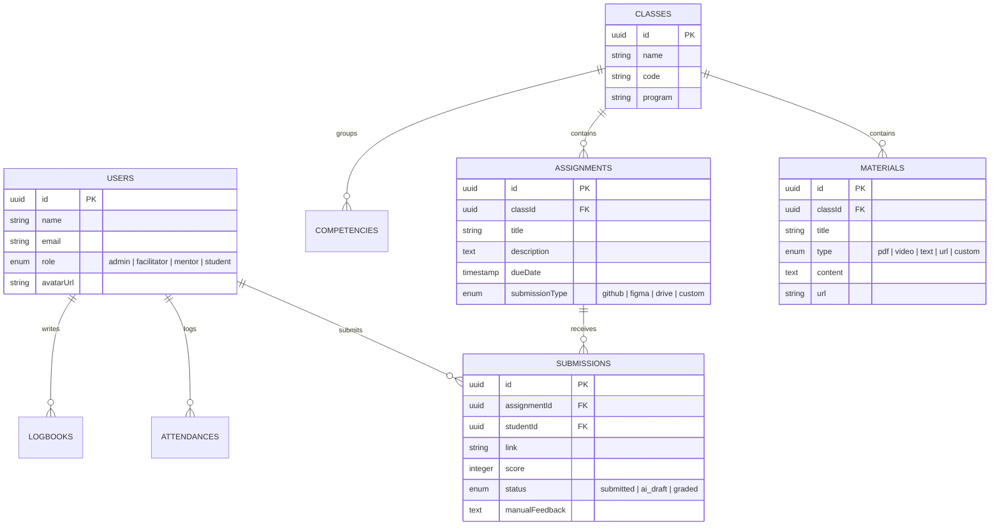

# 🚀 Infinite Learning LMS v2 - Full Technical Specification & Architecture Document

> **Document Purpose**: Technical architecture summary, stack breakdown, and system specification document for developer portfolios, CVs, and technical documentation.

---

## 📌 Executive Summary

**Infinite Learning LMS v2** is an enterprise-grade, multi-role **Learning Management System (LMS)** designed to streamline digital class delivery, syllabus management, student attendance tracking, interactive assignment submissions, and AI-assisted grading workflows.

Developed using **AI-Driven Development** with **Google Antigravity**, the system is built on a modern, decoupled architecture featuring a **Next.js 16 (Turbopack) & React 19** frontend paired with a high-performance **NestJS 11 & TypeORM** backend powered by a **Supabase PostgreSQL** database and **Cloudflare R2** object storage.

---

## 🏗️ High-Level System Architecture

```mermaid
graph TD
    Client["💻 Web Client (Next.js 16 + React 19 + Tailwind v4)"]
    
    subgraph Frontend Services
        Router["App Router (Turbopack)"]
        UIComp["Base UI / Shadcn UI Components"]
        RichText["RichTextRenderer (TipTap + Markdown)"]
        FetchInterceptor["Global JWT / Session Fetch Interceptor"]
    end

    subgraph Backend API (NestJS 11 Engine)
        AuthModule["Auth Module (Passport JWT / OAuth2 / Sessions)"]
        ClassModule["Classes & Syllabus Module"]
        UserModule["User & RBAC Module"]
        AttendanceModule["Attendance & Logbook Module"]
        StorageModule["AWS S3 Storage Engine"]
        AuditModule["Audit Logging Service"]
    end

    subgraph Infrastructure
        DB[(Supabase PostgreSQL Database)]
        AWS[(AWS S3 Cloud Bucket)]
    end

    Client --> Router
    Router --> UIComp
    Router --> RichText
    Client --> FetchInterceptor
    FetchInterceptor -->|"HTTP REST API (Bearer JWT / Session)"| AuthModule
    FetchInterceptor --> ClassModule
    FetchInterceptor --> AttendanceModule
    FetchInterceptor --> StorageModule

    AuthModule --> DB
    ClassModule --> DB
    UserModule --> DB
    AttendanceModule --> DB
    AuditModule --> DB
    StorageModule --> AWS
```

---

## 🌐 1. Frontend Architecture & Technology Stack

### Core Frameworks & Libraries
* **Framework**: **Next.js 16.2.9** using App Router and **Turbopack** build engine.
* **UI Library**: **React 19.2.4**.
* **Language**: **TypeScript 5.x** with strict type safety.
* **Styling Engine**: **Tailwind CSS v4** with `@tailwindcss/postcss` and custom HSL CSS Variables.
* **Component Primitives**: **Base UI (`@base-ui/react`)**, **Shadcn UI (`shadcn@4.12`)**, **Class Variance Authority (`cva`)**, `clsx`, `tailwind-merge`.
* **Icons**: **Lucide React (`lucide-react`)**.
* **Animations**: **Framer Motion (`framer-motion@12`)** & `tw-animate-css`.
* **Theme Management**: **`next-themes`** with seamless Dark/Light Mode switching.
* **Toast Notifications**: **Sonner (`sonner@2`)**.

### Rich Text & Content Rendering Engine
* **Rich Text Editor**: **TipTap Editor (`@tiptap/react`, `@tiptap/starter-kit`, `@tiptap/extension-link`)**.
* **Markdown Support**: **React Markdown (`react-markdown@10`)** for rendering feedback and developer docs.
* **Universal `RichTextRenderer`**:
  * Auto-detects TipTap HTML output (`<h2>`, `<p>`, `<strong>`, `<em>`, `<ul>`, `<ol>`, `<code>`, `<iframe>`).
  * Features a multi-pass **HTML Entity Decoder (`decodeHtmlEntities`)** to sanitize and parse entity-escaped database strings (`&lt;h2&gt;` $\rightarrow$ `<h2>`).
  * Styled with Tailwind Typography (`.prose prose-sm dark:prose-invert`).
  * **Responsive Widescreen Embed**: Auto-scales embedded YouTube, Figma, and Craft.me `<iframe>` elements to a 16:9 aspect ratio (`aspect-video`) without bottom crop issues.

### Data Visualization & Data Handling
* **Charts**: **Recharts (`recharts@3`)** for attendance metrics and student progress dashboards.
* **CSV Parser**: **PapaParse (`papaparse@5`)** for batch importing student rosters and attendance logs.

---

## ⚙️ 2. Backend Architecture & Technology Stack

### Core Frameworks & APIs
* **Framework**: **NestJS 11.0.1** (Node.js Enterprise Framework) with modular dependency injection.
* **ORM & Database Client**: **TypeORM 1.0.0** with PostgreSQL driver (`pg`).
* **Database Engine**: **Supabase PostgreSQL** hosted on AWS AP-Southeast (Singapore).
* **Validation & DTOs**: `class-validator` & `class-transformer` for incoming request payloads.
* **Authentication**: **Passport.js (`@nestjs/passport`)**, `passport-google-oauth20` (Google SSO), `express-session`, and `bcryptjs` password hashing.
* **Security & Rate Limiting**: **Helmet (`helmet@8`)** for security headers and **`@nestjs/throttler`** for API rate limiting.
* **Cloud Storage Integration**: **AWS SDK v3 (`@aws-sdk/client-s3`)** for secure file uploads.
* **Mail Service**: **Nodemailer (`nodemailer@9`)** for automated notifications and password reset emails.

---

## 🔒 3. Security, Authentication & Role-Based Access Control (RBAC)

The application enforces strict **Role-Based Access Control (RBAC)** across 4 distinct user roles:

| Role | Access Scope & Responsibilities |
| :--- | :--- |
| 🛡️ **Admin** | Full system control: User management, class creation, program modal settings, audit log monitoring, global attendance overviews. |
| 👨‍🏫 **Facilitator** | Program-level supervision, student cohort monitoring, attendance validation, and competency metrics. |
| 🎓 **Mentor** | Class room management, syllabus creation, material uploading, assignment creation, student grading, and AI mass evaluation. |
| 👨‍🎓 **Mentee / Student** | Interactive class room access, material reading, assignment submission (GitHub, Figma, Drive), logbook submission, attendance check-in. |

### Authentication Pipeline
1. **Dual Authentication**: Supports both traditional Email/Password credentials and **Google OAuth 2.0 Single Sign-On (SSO)**.
2. **Session & JWT Middleware**: Sessions are stored securely with `connect-pg-simple`.
3. **Global Fetch Interceptor**: Frontend automatically attaches Bearer tokens and credentials (`credentials: 'include'`) on every API request.

---

## 🛠️ 4. Key Feature Engineering Breakthroughs

### 1. Multi-Role Adaptive Dashboard
* Dynamic role resolution redirects users to tailored dashboards (`AdminDashboard`, `FacilitatorDashboard`, `MentorDashboard`, `StudentDashboard`).
* Real-time metrics on attendance percentage, completed assignments, and grade distribution.

### 2. Syllabus & Class Room Workspace
* **Gradient Competency Folders**: Groups learning units into expandable accordions with live item counters (*X Modul*, *Y Tugas*).
* **Distinct Visual Themes**:
  * **Modul Materi**: Styled in signature **Brand Purple** (`#8A3DFF`) with `<BookOpen />` and `<Video />` icons.
  * **Tugas Praktik**: Styled in energetic **Warm Amber/Gold** (`#F59E0B`) with `<ClipboardList />` icons for immediate visual distinction.
* **Custom Link Embed Fallbacks**: Graceful fallback cards for external resources (Craft.me, Notion, Figma) when iframe embedding is restricted by third parties.

### 3. Student 2-Column Assignment Workspace
* **Left Column**: Detailed instruction guide rendered via `RichTextRenderer` alongside mentor feedback blocks with score circles.
* **Right Column**: Sticky Submission Hub with link validation (GitHub, Figma, Google Drive), submission history logs, and edit modes.

### 4. AI-Assisted Bulk Assignment Evaluation Engine
* Mentors can evaluate mentee submissions en masse using AI assistance (`BulkAiEvaluateModal`), producing initial AI draft scores (`ai_draft`) before final manual approval (`graded`).

---

## 📊 5. Database Schema & Entity Relationships



---

## ⚡ 6. Portfolio Resume & Summary Snippets

### For Resume / CV Experience Section
> **Full-Stack Software Engineer | Infinite Learning LMS v2**
> * Co-architected and built an enterprise-grade Learning Management System (LMS) serving hundreds of mentees and mentors using **Next.js 16 (Turbopack)**, **React 19**, **NestJS 11**, **TypeORM**, and **Supabase PostgreSQL**.
> * Engineered a custom **TipTap + Markdown HTML Rendering Engine** featuring multi-pass HTML entity decoding and responsive 16:9 iframe video embeds.
> * Designed role-based dashboards (Admin, Facilitator, Mentor, Student) and implemented a 2-column student assignment workspace with platform link validation.
> * Implemented NestJS authentication pipeline featuring Google OAuth2 SSO, Passport JWT, AWS S3 storage integration, and audit logging.

### For LinkedIn / Portfolio Case Study
* **Project Name**: Infinite Learning LMS v2
* **Role**: Full-Stack Developer (Collaborative 2-person engineering team)
* **Stack**: Next.js 16 (Turbopack), React 19, Tailwind CSS v4, NestJS 11, TypeORM, Supabase Postgres, AWS S3, TipTap Editor, Recharts.
* **Key Highlights**: Built scalable class syllabus accordions, TipTap rich text rendering with entity decoding, AI-assisted mass assignment evaluation, and logbook attendance tracking.

---

*Document Generated for Infinite Learning LMS v2 Workspace Architecture Spec.*
